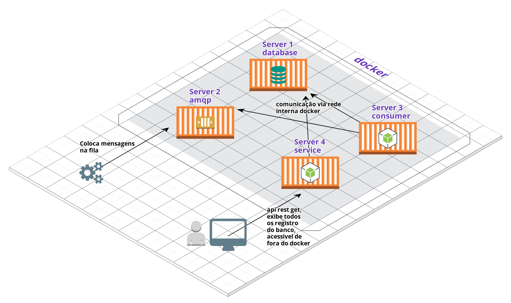
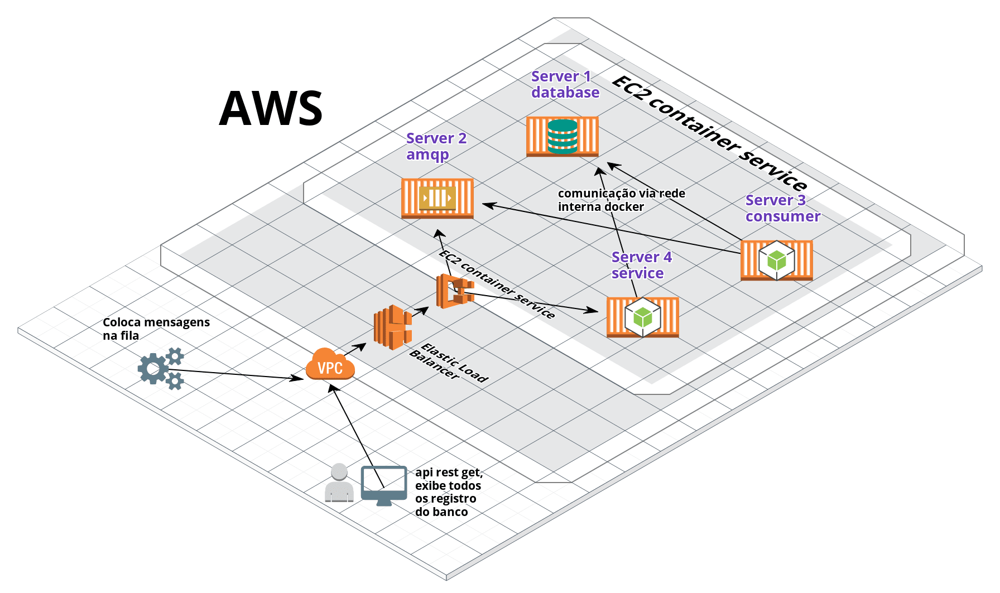

### Descrição
```sh
Esse projeto é uma simples demonstração para a criação de 4 microserviços
rodando em Docker e se comunicando por uma rede interna Docker.

Para o teste ficar mais fácil coloquei tudo em 1 repositório e
centralizei o start e config de todos os services em um único comando.
```
#### Desenho da arquitetuira construida

#### Server1 database
```sh
banco de dados para guardar as mensagens recebidas.
- docker
- mongodb
- ip interno: 172.28.2.1
```
#### Server2 amqp
```sh
fila para receber as mensagens.
- docker
- rabbitmq
- ip interno: 172.28.2.2
```
#### Server3 consumer
```sh
job para ler mensagens do rabbitmq e guardar no mongo.
- docker
- nodeJs
- ip interno: 172.28.2.3
- testes unitátios
- vide readme do consumer
```
#### Server4 service
```sh
api rest para exibir os registros do mongodb.
- docker
- nodeJs
- ip interno: 172.28.2.4
- ip externo: http://127.0.0.1:8080/
- helmet com filtro xss
- testes unitátios
- vide readme do service
```
#### Pré requisitos
```sh
docker
docker-compose
```
#### Run
```sh
docker-compose up &
```
### Proposta infra aws
Também estou enviando uma proposta de infra aws

### Não deu tempo pra fazer
```sh
- Adicionar 'healthcheck' do docker pra esperar um serviço subir antes de subir o outro.
- Criar o AWS CloudFormation.
- Colocar TypeScript
```
